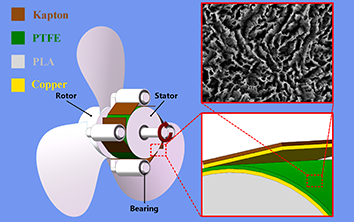
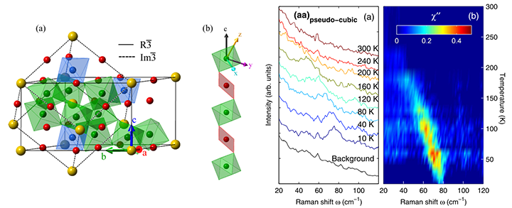

平生无趣，最爱较真，是非曲直，盐咸醋酸，于旁人无所谓者，于我当有所谓。世间万物依道而行，夫道者，规律、定理、推论、假说者是也。求道之艰辛，得道之快乐，记录于此，无昭告天下之心，有旮旯独乐之意。 

联系方式
======
办公室：天工大C座716B。  
电话：010-82854790  
邮箱：duxinyu_at_binn.cas.cn  
个人主页：www.duxinyu.cn

教育背景
======
 
| 学位  | 时间       | 专业  | 单位  |
| ---- |----------- | -----| ---- |
| 理学博士  | 2005-2010 | 物理 | 北京工业大学|
| 理学学士  | 2000-2004 | 物理 | 北京工业大学|

工作经历
=======

| 职位  | 时间       |  单位  |
| ---- |----------- | ----- |
| 助理研究员  | 2015-至今 | 中科院北京纳米能源与系统研究所|
|博士后  | 2013-2015 | 北京大学，国际量子材料中心|
|研发部门经理  | 2010-2013 | 北京时林公司|

研究兴趣
=======

1. 纳米发电机，微纳传感器件，纳米纤维材料。利用物理化学方法制备具有特殊性能的纳米材料，用作能量收集，自供能传感，能量存储等。
2. 强关联电子系统的散射谱学研究。利用Raman散射，X射线散射，中子散射等手段研究强关联电子体系的结构和动力学性能。特别是过渡金属氧化物中自旋、轨道、晶格之间的耦合机理研究。
3. 利用人工智能解析传感器网络采集的信号，通过信号还原行为。

研究亮点
=======

## 仿鱼鳞结构纳米发电机

该纳米发电机输出的开路电压峰峰值超过500 V，可以用来高效的收集风能，水流能，机动车制动等转动机械能。此外，利用能量管理电路将纳米发电机输出的高压交流电转化成了5V的低压直流电。持续的驱动无线传感器对环境进行实时监控，从而形成自驱动的无线传感器件。这种自驱动的无线传感器可以广泛的部署，从而在环境保护、基础设施监控、国防安保监控等领域发挥重要作用。文章发表在[Nano Research](http://www.thenanoresearch.com/work_just.asp)上。

## 第二类多铁材料CaMn7O12的拉曼散射谱学研究

利用变温拉曼散射观测到了一个软化振动模式，该振动模式的能量虽温度的升高而降低，最终在250 K左右时消失。该特征温度对应于非公度轨道序出现的温度。因此，该软化模式起源于非公度轨道序导致的晶格对称性下降。晶格对称性下降导致的布里渊区折叠使得该模式出现在了布里渊区中心从而可以被拉曼散射观测到。相关工作发表在[Phys. Rev. B](https://journals.aps.org/prb/abstract/10.1103/PhysRevB.90.104414)上。