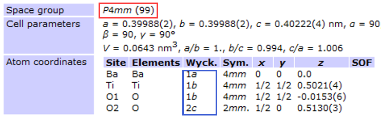
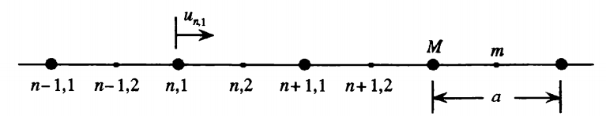
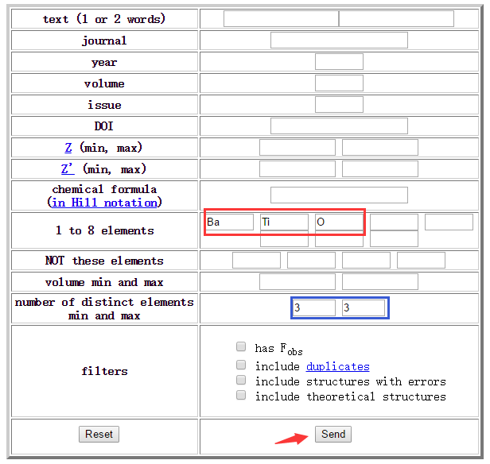
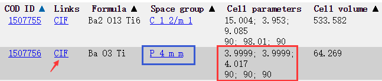
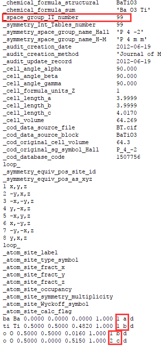
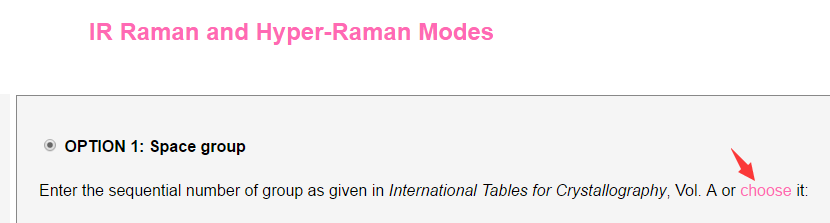
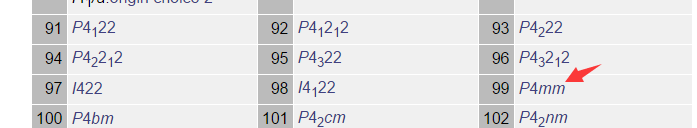
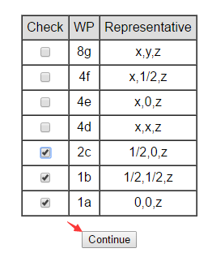
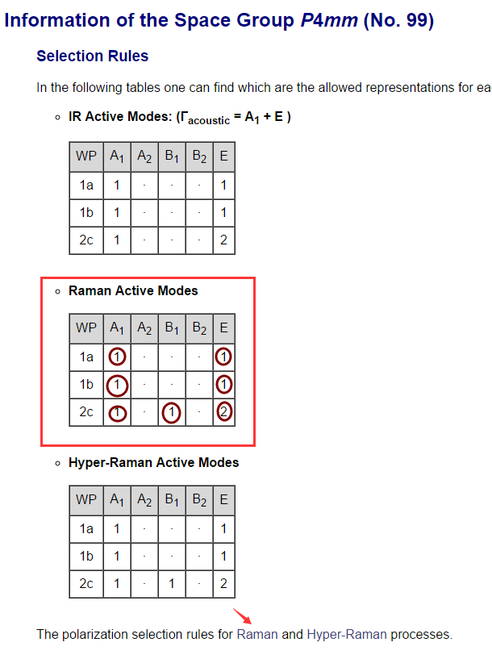
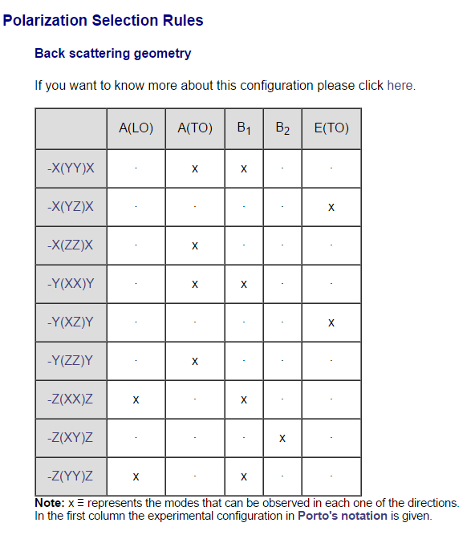

# 1. 基本原理

拉曼散射光谱是通过观察激光与物质相互作用来表征物质内部结构、能态的谱学技术。激光与物质作用会发生瑞利散射和拉曼散射(斯托克斯和反斯托克斯散射)，如图1所示。其中瑞利散射只改变光的方向，光子的频率即能态不变，属于弹性散射，光与物质没有能量交换。而拉曼散射属于非弹性散射，光的方向和能态都有改变。通过观察散射光与入射光之间的频率差可以分析出物质内部原子振动的频率、振动的方式等信息。

图1. 拉曼散射原理

图2. 拉曼散射谱

图2是典型的拉曼散射拉曼散射谱，横坐标为散射光与入射光的频率差，及Raman shift，纵坐标为散射光强度。由于不同材料中原子的振动频率，振动方式不同，因此拉曼散射也可以当做指纹谱用来鉴别材料。拉曼散射谱中最核心的问题是出现多少个峰，出现在什么位置，这些峰表达出什么信息。下面就以结构最简单的单晶作为研究对象来介绍拉曼散射谱的解读方法。

# 2. 单晶拉曼散射

## 2.1 背景知识

首先需要对晶体的结构有一定了解，因为晶体的对称性决定了那些振动模式能够被拉曼散射观测到，即激活的拉曼模式。

### 2.1.1晶格结构

晶格结构一共分为7大晶系，14种布拉维格子，32个点群和230种空间群，如下表所示。

|        晶系         |                  布拉维格子                   |                   基矢特征                   |                   空间群                    |
| :---------------: | :--------------------------------------: | :--------------------------------------: | :--------------------------------------: |
|  三斜 (Triclinic)   |                 简单三斜 (P)                 | $$a\not=b\not=c$$ $$\alpha\not=\beta\not=\gamma$$ |              $$P1,P\bar 1$$              |
|  单斜 (Monoclinic)  |       简单单斜 (P) 底心单斜 (B or A)        | $$a\not=b\not=c$$ $$\alpha=\beta=90^o\not=\gamma$$ |    $$P2,Pm,P2/m$$ $$B2,Bm,B2/m$$    |
|  六角 (Hexagonal)   |                  六角 (P)                  | $$a=b\not=c$$ $$\alpha=\beta=90^o,\gamma=120^o$$ | $$P6,P\bar6,P6/m,P622,P6mm,P\bar6m2,$$ $$P\bar62m,P6/mmm$$ |
|   三角 (Trigonal)   |                 三角 (R,P)                 | $$a=b=c$$ $$\alpha=\beta=\gamma\not=90^o$$ | $$R3,R\bar3,R32,R3m,R\bar3m$$ $$P3,P\bar3,P312,P321,P3m1,P31m,P\bar31m,P\bar3m1$$ |
| 正交 (Orthorhombic) | 简单正交 (P) 底心正交(C,A or B) 体心正交 (I) 面心正交 (F) | $$a\not=b\not=c$$ $$\alpha=\beta=\gamma=90^o$$ | $$P222,Pmm2,Pmmm$$ $$C222,Cmm2,Amm2,Cmmm$$ $$I222,Imm2,Immm$$ $$F222,Fmm2,Fmmm$$ |
|  四方 (Tetragonal)  |          简单四方 (P) 体心四方 (I)          | $$a=b\not=c$$ $$\alpha=\beta=\gamma=90^o$$ | $$P4,P\bar4,P4/m,P422,P4mm$$ $$P\bar42m,P\bar4m2,P4/mmm$$ $$I4,I\bar4,I4/m,I422,I4mm$$ $$I\bar42m,I\bar4m2,I4/mmm$$ |
|    立方 (Cubic)     |   简单立方 (P) 体心立方 (I) 面心立方 (F)   | $$a=b=c$$ $$\alpha=\beta=\gamma=90^o$$ | $$P23,Pm3,P432,P\bar43m,Pm3m$$ $$I23,Im3,I432,I\bar43m,Im3m$$ $$F23,Fm3,F432,F\bar43m,Fm3m$$ |

只要是单晶，其晶格结构必定是230个空间群之一。图3是四方钛酸钡的晶格结构信息。从图中可以看出其属于立方晶系，P4mm点群，99号空间群，如图中红框所示。蓝框为原子所处的Wyckoff 位置。有了这些信息就可以通过群论分析出该晶体有几个激活的拉曼模式（可观测到的拉曼峰），分别是什么（属于何种振动模式，如Ag 模式，Eg 模式等）。具体分析方法请参看2.3。

图3. 立方钛酸钡晶格结构信息

### 2.1.2 声子

图4. 一维双原子模型

原子并不是静止的处在某一个位置，而是以某个位置为平衡点振动。单晶中的原子排列整齐，其振动具有集体性，这种晶格的振动称为**声子**，**phonon**。图4为一维双原子模型，其中同种原子间距为a （一维晶格长度），两种原子质量分别为m，M。$$u_{n,1}$$ 为以n,1为中心振动的原子对其平衡位置的偏离。假设只考虑最近邻原子间的相互作用，且$$\beta$$ 为原子间作用力常数。则，运动方程为：

$$
\begin{cases}
M\ddot{u}_{n,1}=\beta[u_{n,2}+u_{n-1,2}-2u_{n,1}],\\
m\ddot{u}_{n,2}=\beta[u_{n+1,1}+u_{n,1}-2u_{n,2}],\end{cases}
$$

该运动方程具有波动形势的解：

$$
\begin{cases}
u_{n,1}=Ae^{i(qna-\omega t)},\\
u_{n,2}=Be^{i(qn-\omega t)},\end{cases}
$$

将波动形势的解带入运动方程得：

$$
\begin{cases}
(M\omega^2-2\beta)A+\beta(1+e^{-iqa})B=0,\\
\beta(1+e^{iqa})A+(m\omega^2-2\beta)B=0,\end{cases}
$$

有解条件要求系数行列式为零，因此得到振动频率$$\omega$$ 与波矢$$q=2\pi/\lambda$$ 的关系如下：

$$
\omega^2_{\pm}=\beta\frac{m+M}{mM}\{1\pm[1-\frac{4mM}{(m+M)^2}sin^2(\frac{1}{2}qa)]^{\frac{1}{2}}\}
$$

上式的物理模型如图5a所示，振动分为两种模式，光学模$$\omega_+$$和声学模$$\omega_-$$ ，振动波长为$$\lambda$$ 。 图5b称为色散关系，横坐标为动量$$q$$ ，纵坐标为能量 $$\omega$$ 。由于光子不携带动量，因此激光拉曼光谱没有动量分辨率。所以只能观测到色散关系中$$q=0$$ 的振动模式，即图5b中纵坐标轴与曲线的焦点。又由于声学支与纵坐标焦点在$$\omega=0$$ 处，该位置被瑞利散射覆盖。因此，在一维双原子连的情况下，拉曼散射只能看到光学支的振动模式。

图5. 一维双原子振动模型(a)，及其色散关系(b)

## 2.3 获取材料晶格结构信息

获取材料的晶格结构信息是分析单晶拉曼散射的第一步。获取途径有：文献，晶格结构数据库。下面介绍两个公共数据库：

1. Crystallography Open Database：[http://www.crystallography.net/cod/search.html](http://www.crystallography.net/cod/search.html)
2. American Mineralogist Crystal Structure Database: [http://rruff.geo.arizona.edu/AMS/amcsd.php](http://rruff.geo.arizona.edu/AMS/amcsd.php)

可以通过这两个数据库查询得到包含晶格结构信息的CIF文件。下面以第一个数据库为例介绍如何查询四方BaTiO3的CIF文件，如图6所示。首先在搜索框中输入元素种类（图中红框），然后限定元素种类（图中蓝框），最后点击send按钮。

图6. 查询晶格结构CIF文件

点击send按钮后输出结构如图7所示，点击红色箭头所指CIF处下载CIF文件。

图7. 晶格结构查询结果页面

用文本编辑器打开CIF文件获取晶格结构信息（也可以用软件打开，如crystalMaker，Diamond，Materials Studio等），如图8所示。从文件内容中获取两个最重要的信息，空间群号和每个原子的Wykoff位置。图8显示四方钛酸钡属于99号空间群，其中Ba的Wykoff位置为1a,Ti为1b，O1为1b，O2为2C。记住这些信息就可以通过群论的方法分析出该结构晶体有多少个激活的拉曼散射模式。

图8. CIF文件内容

## 2.4 Raman激活模式分析

分析方法可参考文献：D. L. Rousseau, R. P. Bauman, S. P. S. Porto, J. Raman Spectrosc. 1981, <b>10</b>, 253.

这是1981年贝尔实验室的D. L. Rousseau等发表在JOURNAL OF RAMAN SPECTROSCOPY的论文“Normal Mode Determination in Crystals”。

目前已经有更简单的查询服务供科研工作者使用，网址为：[http://www.cryst.ehu.es/rep/sam.html](http://www.cryst.ehu.es/rep/sam.html)

打开该网址后页面如下所示，点击choose。

点击choose后出现如下页面，在里面找到99号空间群。

找到99号空间群后点击其后面的P4mm，显示如下页面。

勾选结构中存在的wykoff位置，四方钛酸钡为1a,1b,2c三个位置如图8所示，然后点击Continue按钮。出现如下页面，找到其中的Raman Active Modes表格，得到该结构的拉曼激活模式。

从表格中我们可以获得的信息有，四方钛酸钡有三类振动可被拉曼观测到其特征标分别为：A1, B1 和 E。其中A1有4个模式可被观测到，因为1b位置上有两个原子，O1和Ti原子各贡献一个峰。B1有1个模式可被观测到。 E有5个模式可被观测到。因此，四方钛酸钡一共有10个拉曼峰可被观测到,$$\Gamma_\mathrm{Raman}=4A_1+1B_1+5E$$ 。

## 2.5 Raman选择定则

如果样品是多晶材料那么拉曼谱一定是所有模式的混合叠加，不可能单独观测某种特征标的模式。而如果样品是单晶，那么可以利用选择定则来选择性的观测，比如只观察四方钛酸钡中A1 模式的振动谱。选择的方式就是通过调整入射光偏振方向，散射光偏振方向和晶体晶轴方向之间的几何关系。

### 2.5.1 Porto表达式 

Porto表达式是用来表达拉曼散射光谱的几何配置的。其形式为：A(BC)D，其中：

- A为入射光传播方向。
- B为入射光偏振方向。
- C散射光偏振方向。
- D散射光传播方向。

例如：X(YZ)-X 为背散射，入射光与散射光偏振方向垂直且垂直于入射光方向。

### 2.5.2 选择定则的查询方法

点击上图中红色箭头所指的Raman字样，打开选择定则页面，如下所示。从表格中可以查询到观测各种模式的几何配置。其中LO表示光学纵模，TO表示光学横模。

# 3. 结语

以上介绍了拉曼散射的基本原理以及声子的概念和拉曼光谱的分析方法。拉曼光谱具有非常广泛的应用。除了单晶拉曼光谱外，多晶、无定型、液态、气态材料都可以利用拉曼光谱来表征。其在宝石鉴定，古董鉴定，健康监测等方面也发挥着重要的作用。

