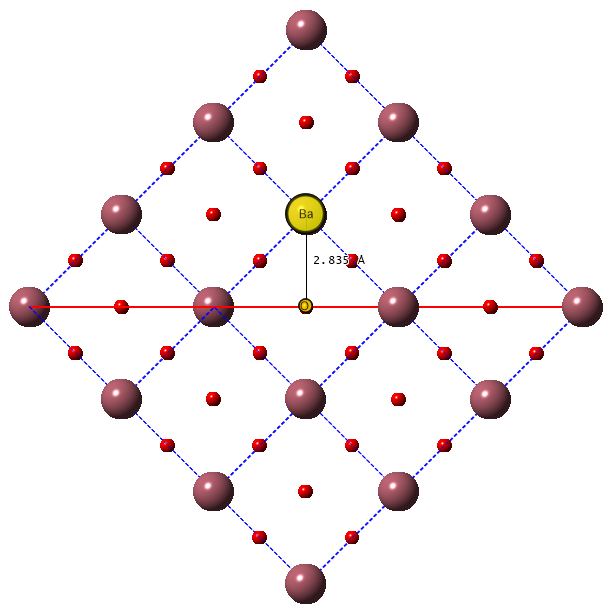
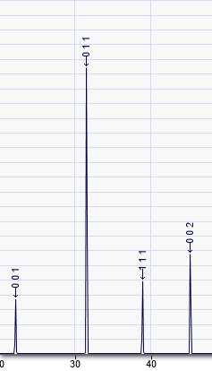
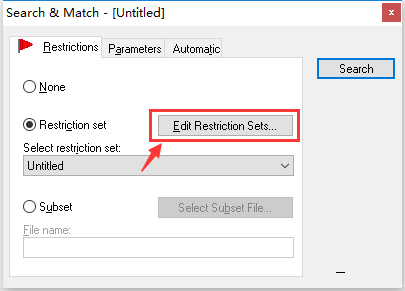
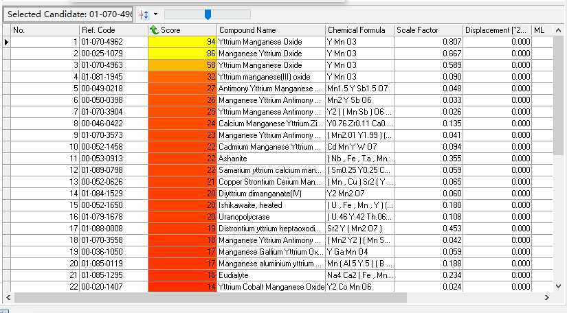
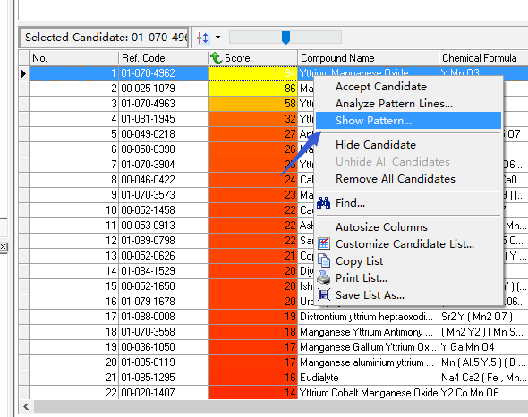
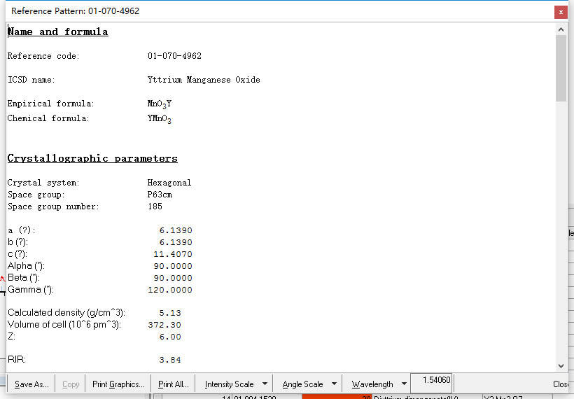
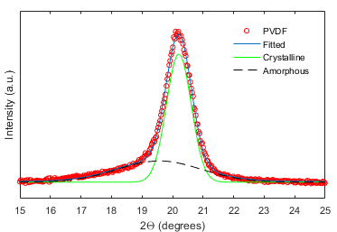

# 1. 基本原理

# 

图1. 布拉格衍射示意图

图2. TiO2粉末XRD谱图

图1为XRD原理图，图2位典型的XRD谱图。由图1可知，两束射线经过晶面反射后光程差为
$$
2dsin\theta
$$
因此，当光程差为波长整数倍时发生干涉，从而出现峰值。

布拉格定律：
$$
2dsin\theta=n\lambda
$$

$$\lambda$$: X射线波长, $$d$$:晶面间距, $$\theta$$: X射线与晶面夹角

实验过程中$$\theta$$角逐渐变化，当满足布拉格定律时，在相应的2$$\theta$$处出现衍射峰。确定物相时需要将样品研成粉末，这样各个晶面都能出现在样品中，相当于不同大小的$$d$$同时出现在射线下（不同晶面的晶面间距$$d$$不同）。因此，可以看到该材料所有可能的衍射峰。

 举个例子。 

立方相钛酸钡XRD谱如图4所示，主峰为(0 1 1)，出现在$$2\theta=31.5244^o$$处。X射线波长$$\lambda=0.15405 nm$$，(0 1 1)晶面间距$$d=0.2835 nm$$如图3所示。

图3. 立方钛酸钡晶格结构中(0 1 1)晶面间距

图4. 立方钛酸钡XRD

将波长$$\lambda$$和晶面间距$$d$$带入布拉格公式，取n=1，计算得到$$2\theta=31.53^o$$，与图4中主峰位置一致。

# 2. 应用

## 2.1 确定物相

将粉末样品放入样品池并压平，随后设置参数，参数主要包括：扫描范围，扫描步长，积分时间等。设置好参数后进行实验。

用X'Pert HighScore Plus软件打开实验结果文件.图标如左图所示。

打开文件，点击`File->Open选择实验结果文件`。

接着进行比对匹配，用PDF卡片库里的数据跟实验结果比对，将匹配度最高的若干项列出来供参考。

点击`Analysis->Search & Match->Excute Search & Match`,出现如下对话框

点击`Edit Restriction Sets`按钮，出现如下对话框。在输入框中输入元素（红框）或点击元素周期表按钮（蓝框）进行选择，然后点击Close按钮。

回到Search & Match对话框点击Search按钮，如下图所示。

搜索完成后会在右下角出现匹配的结果，按匹配度高低从上往下排列。匹配度用分数和颜色区别，分数越高匹配度越高，如下图所示。

右键点击任意匹配项，在弹出菜单中选择`show pattern`如下图所示。

弹出匹配项晶格信息，包括卡片号，所属晶系，所属点群，a,b,c轴长度，$$\alpha，\beta，\gamma$$夹角等信息，如下图所示：

## 2.2 计算晶粒尺寸

XRD谱中，衍射峰宽度和样品晶粒尺寸符合如下公式。

Scherrer公式：$$D_{hkl}=k\lambda/\beta cos\theta$$

其中：$$D_{hkl}$$ 为垂直于晶面(h k l)方向上的晶粒尺寸；$$\lambda$$ 为X射线波长；$$\beta$$ 为(h k l)衍射峰的半高宽；$$\theta$$ 布拉格衍射角，即XRD谱图中(h k l)衍射峰所对应的横坐标的一半。$$k=0.89$$ 为Scherrer常数。

## 2.3 计算材料的结晶度

材料特别是有机物材料一般为晶态和非晶态的混合物，**结晶度**是描述物质中晶态占总质量百分比的量，其定义为：

$$X_c=\frac{W_c}{(W_c+W_a)}$$

其中，$$W_c和W_a$$ 为样品中结晶态物质与无定型态物质的质量。

一般晶态对应XRD衍射中的尖峰，无定型态对应扁而宽的馒头峰，如图5所示。

图5. $$\beta$$ 相PVDF薄膜中晶态与无定型态XRD峰的拟合

晶态与无定型态的含量与对应的峰强相当。因此结晶度为：

$$X_c=\frac{I_c}{(I_c+kI_a)}$$

其中$$I_c和I_a$$ 分别为结晶态和无定型态衍射峰强度，$$k$$ 为相对散射因子，定义为用于计算衍射峰强度之和与所有衍射峰强度之和的比值。

$$k=\frac{\sum_iI_{c_i}}{\sum_jI_{c_j}} (J\ge i)$$

 举个例子。

如图5所示，实验可观察到的衍射峰只有一个，因此$$k=1$$ ，其结晶度$$X_c=\frac{I_c}{(I_c+I_a)}$$

## 2.4 确定晶体解理面的晶向。

用单晶解理面作为反射面的话可以通过XRD谱判断解理面的方向。如XRD谱中只出现 (0 0 4)峰，则可以判断该面与c轴垂直。