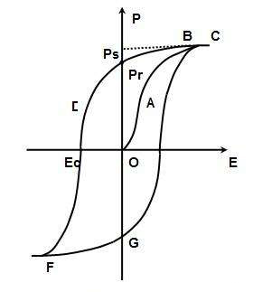
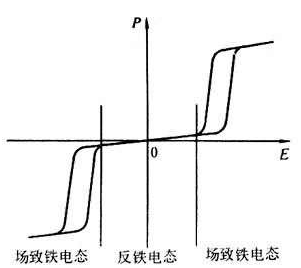
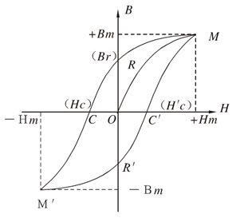
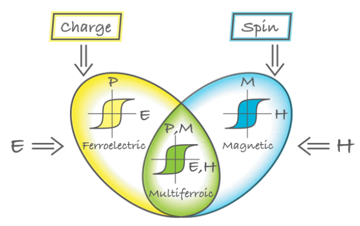
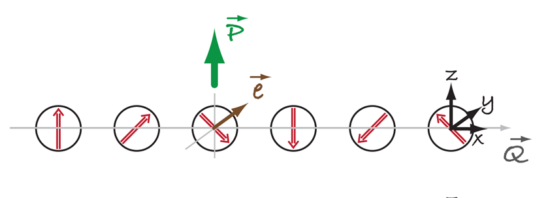

# 1. 铁电与铁磁

## 1.1 电偶极矩

两个点电荷，一个带+q，另一个带-q，距离r，则电偶极矩为：
$$
\vec{p}=q\vec{r}, \vec{r}是由-q指向+q的位移矢量
$$

## 1.2 铁电、顺电、居里温度、反铁电态

**铁电性 (Ferroelectricity)**：晶胞结构导致正负电荷中心不重合而出现电偶极矩，且电偶极矩的方向可以随外电场改变，从而在电场方向上形成电极化强度。本质上铁电性是晶格结构具有空间反演对称性的破缺导致的。铁电材料典型特征是具有电滞回线，如图1所示。当电场归零后仍然具有剩余极化强度**Pr**。电滞回线反应的是众多电偶极子随外电场改变方向的物理现象。

图1. 铁电体电滞回线

**居里温度(Curie temperature，Tc)：** 是材料内正负电荷中心重合与不重合的转变点，即有无电偶极矩的转变点。一般高于居里温度时材料正负电荷中心重合，没有空间反演对称性的破缺。因此没有铁电性，称为顺电态。低于居里温度出现电偶极矩，称为铁电态。

**顺电态(Paraelectric state)** ：当材料在居里温度以上，晶格结构没有空间反演对称性的破缺，因此没有电偶极矩，称为顺电态。理论上顺电态时材料的电滞回线为一条斜线，不包含面积，剩余极化强度**Pr**为零。

**反铁电(Antiferroelectricity)**: 相邻两个电偶极矩成反平行排列，宏观上自发极化强度为零，电滞回线成双回线，如图2所示。

图2. 反铁电体电滞回线

## 1.3 铁磁、顺磁、尼尔温度、反铁磁

**铁磁性(Ferromagnetism)** ：是指物质中相邻原子的自旋由于交换作用而在某些区域中大致按同一方向排列，当所施加的磁场强度增大时，这些区域的自旋定向排列程度会随之增加到某一极限值的现象。铁磁性的本质是材料时间反演对称性的破缺。其典型特征是磁滞回线，如图3所示。

图3. 磁滞回线

**尼尔温度(Neel temperature, TN)**: 高于此温度材料自旋杂乱无序，称为顺磁态。低于此温度材料自旋具有特定结构。

**反铁磁(Antiferromagnetism)**: 相邻自旋成反平行结构排列。

# 2. 多铁材料(Multiferroics)

早在19世纪电和磁就被伟大的麦克斯韦用麦克斯韦方程组统一了起来。然而，材料中存在的电和磁的结构一直被分开研究。主要是由于电子和离子的电荷是电的起源，而电子自旋是磁的起源。然而，材料中的电和磁有时能体现出很强的耦合性能。例如通过电场可以控制材料的自旋结构，或者用磁场控制材料的电极化方向。同时具有自旋序结构和电偶极矩序结构的材料称为**多铁材料** ，如图4所示。多铁材料的本质是材料同时具有空间反演对称性和时间反演对称性的破缺。

图4. 铁电、铁磁、多铁材料示意图

# 3 多铁材料的分类

2009年Daniel Khomskii教授将多铁材料分为两类，分别称为第一类多铁材料(Type-I multiferroics)和第二类多铁材料(Type-II multiferroics)[1]。

## 3.1 第一类多铁材料

第一类多铁材料首先被人们发现，数量也更多。这类材料通常有非常强的铁电性，而且材料的居里温度和尼尔温度高于室温。不幸的是这类材料的电磁耦合性能很弱。典型代表是BiFeO3。处于体心的铁原子沿着[111]方向偏离体心形成电极化强度。而磁性由铁原子的自旋提供。两者并没有很强的耦合。

## 3.2 第二类多铁材料

与第一类多铁材料相反，第二类多铁材料的铁电性往往很弱，尼尔温度一般在室温以下。但却有很强的电磁耦合性能。例如TbMnO3 ，在28 K下才出现电极化强度，但电极化强度会随着外加磁场变化[2]。具有相同性质的材料还有TbMn2O5, 在1.5 T的磁场下电极化强度方向可以翻转。该类材料最大的特点是天生具有很强的电磁耦合性能。电极化强度是由自旋结构的产生导致的，因此改变自旋结构就能改变电极化强度，从而实现电和磁的交叉控制。从自旋结构上可以将第二类多铁材料分为螺旋结构自旋序和共线自旋序结构。

### 3.2.1 螺旋自旋结构

典型的螺旋型自旋结构如图5所示。图中红色箭头代表自旋，**Q**是自旋传播方向矢量，**e**是自旋转轴方向矢量，绿色箭头代表电极化方向。根据KNB理论[3]：
$$
\vec{P}\sim\vec{r}_{ij}\times[\vec{S}_i\times\vec{S}_j]\sim[\vec{Q}\times\vec{e}]
$$
可以将图5的模型想象成一个车轮在滚动，自旋就是车轮的辐条，Q是车轮前进的方向，e是车轮的轮轴。根据右手定则**Q**x**e**的方向为图中坐标系中的z方向，如绿色箭头所示。目前发现的大多数第二类多铁材料都属于这种螺旋型自旋结构。

图5. 螺旋自旋结构产生电极化强度。

### 3.2.2 共线型自旋结构

未完待续.....

