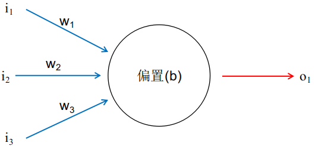
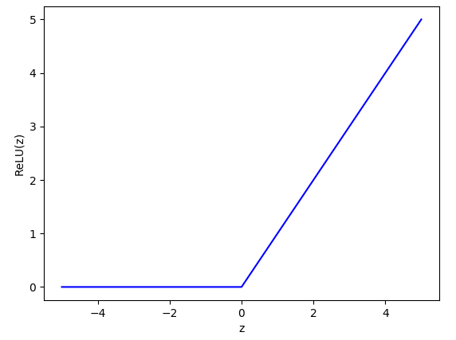
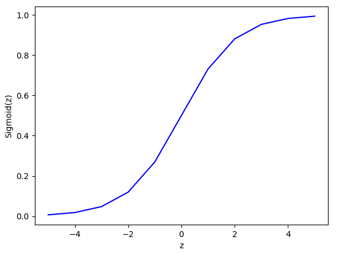
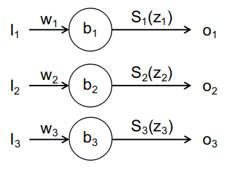
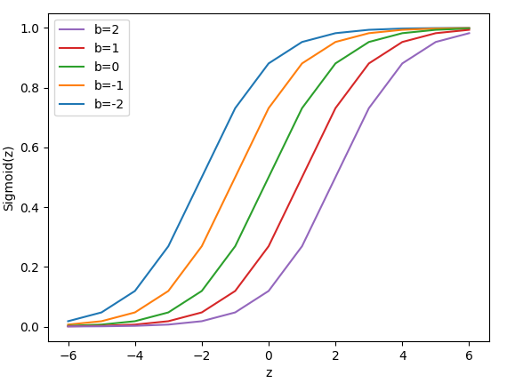
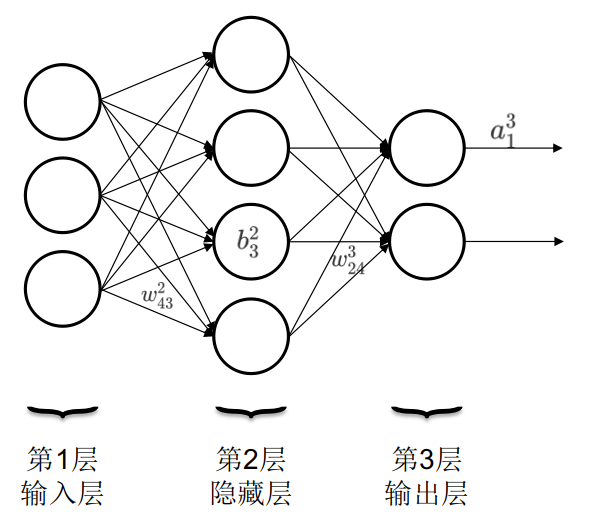

# 1. 神经元

神经元是神经网络的组成元素，任何结构的神经网络模型都是由若干个神经元以某种形式组成的。典型的神经元如图1-1所示。每个神经元可以有若干个输入和输出，一个神经元的输出可以连接到另一个神经元，变成另一个神经元的输入。因此输入和输出个数取决于有多少个神经元与该神经元相连接。

*
图1-1 神经元基本结构
*

为了简明图1-1只画了一个输出，图中黑色圆圈代表神经元，三条蓝色带箭头的线代表输入神经，红色带箭头的线代表输出神经。$$i_1,i_2,i_3$$为输入值（input），$$w_1,w_2,w_3$$为相对应的权重（weight），$$b$$为偏移量（bias），$$a(z)$$为激活函数（activation），$$o_1$$为输出（output）。整个神经元的运作方式如下式：
$$
o_1=a( w_1\cdot i_1+w_2\cdot i_2+w_3\cdot i_3+b) \tag{1-1}
$$

上式描述了典型的神经元工作方式，输入和权重一一对应相乘后求和，然后再与偏置值求和，求和结果带入激活函数中，所得的函数值即为输出。

# 2. 神经元要素

一个完整的神经元由输入**I**nput，权重**W**eight，偏移量**B**ias，激活函数**A**ctivation和输出**O**utput组成，我称其为**IWBAO**结构。这其中输入**I**和输出**O**很好理解，不再赘述。下面分别介绍**WBA**的作用。

### 2.1 激活函数A

激活函数的作用是将输出值限定在一定范围内，这样做的好处是当改变权重值的时候不会引起输出值的巨大变化。有利于神经网络模型在训练过程中的收敛。常用的激活函数有ReLu，sigmoid和softmax，下面逐一介绍。

**ReLu**（Rectified Linear Unit）激活函数的定义如下：
$$
ReLU(z)=\begin{cases}0\quad if\quad z\leq0\\z\quad if \quad z>0\end{cases}\tag{1-2}
$$
当自变量z的值小于等于0时，函数值为0。当自变量的值大于0时，函数值为z，如图1-2所示。

*
图1-2 ReLU函数
*

ReLU函数为单边抑制，即z小于等于0时函数值为0。这种特性使得神经网络在学习过程中可以更好的抓住目标特征。此外，ReLU函数的导数是常数，这有利于拟合过程中的稳定收敛。

**Sigmoid**激活函数的定义如下：
$$
\sigma(z)=\frac{1}{1+e^{-z}}\tag{1-3}
$$
当自变量z趋于正无穷时函数趋近于1，当自变量z趋于负无穷时函数趋于0。sigmoid函数将自变量z映射到了[0,1]之间，如图1-3所示。

*
图1-3 Sigmoid函数
*

Sigmoid函数使得神经元的输出被限定在了[0,1]之间，这使得对权重和偏移量的微小改变导致的输出改变量也是微小的。这样在训练过程中更容易判断调整权重和偏移量的方向和大小。

**Softmax**激活函数的定义如下：
$$
S_i(z_i)=\frac{e^{z_i}}{\Sigma_je^{z_j}}\tag{1-4}
$$
Softmax函数看起来比较晦涩难懂，但其数学意义比较好理解。假设有一组数$$z_i$$，函数值是该自变量$$z_i$$的e指数与所有自变量e指数和的比值。因此，所有$$S_i$$之和为1。该函数可以保证多个神经元输出之和为1，多用于分类任务的神经网络的输出层。比如手写数字识别的神经网络，需要将手写数字分成10个类别，分别对应数字0,1,2,3,...,8,9。softmax函数的值不单单取决于某个神经元的构成元素，还与处于同一层的其他神经元相关，如图1-4所示。

*
图1-4 神经元输出层
*

图中三个神经元组成了一个神经层，每个神经元的输出不单单和本神经元有关，还与同一层的其他神经元有关，同一层的所有神经元输出之和为1。将上图中的模型参数带入式1-4，则各个神经单元的输出可表示为：
$$
o_j=S_i(w_j\cdot i_j+b_j)=\frac{e^{w_j\cdot i_j+b_j}}{\Sigma_k e^{w_k\cdot i_k+b_k}}\\
o_1=S_1=\frac{e^{w_1\cdot i_1+b_1}}{e^{w_1\cdot i_1+b_1}+e^{w_2\cdot i_2+b_2}+e^{w_3\cdot i_3+b_3}}\\
o_2=S_2=\frac{e^{w_2\cdot i_2+b_2}}{e^{w_1\cdot i_1+b_1}+e^{w_2\cdot i_2+b_2}+e^{w_3\cdot i_3+b_3}}\\
o_3=S_3=\frac{e^{w_3\cdot i_3+b_3}}{e^{w_1\cdot i_1+b_1}+e^{w_2\cdot i_2+b_2}+e^{w_3\cdot i_3+b_3}}\tag{1-5}
$$
很容易证明三个输出之和为1，当调整权重和偏移量使得其中一个输出增大时，必然引起另外两个输出的减小，永远保证所有输出量之和为1，这就是softmax的作用。

除了上面详细介绍的ReLU，Sigmoid和Softmax形式的激活函数外还有Tanh，Swish，PReLU和RReLU等多种形式的激活函数，用法大同小异在此不再赘述。

### 2.2 偏移量B

偏移量的作用在于调整激活函数在水平方向上的位置。下面以Sigmoid函数为例说明。如图1-1所示神经元，其输出如式1-1所示。令$$z=w_1\cdot i_1+w_2\cdot i_2+w_3\cdot i_3$$，则其输出为：
$$
o_1=\sigma(z+b)=\frac{1}{1+e^{-(z+b)}}\tag{1-6}
$$
我们看看b取不同的值，sigmoid函数会发生那些变化，如图1-5所示。

*
图1-5 偏移量对输出的影响
*

从图中可以看出，偏移量的变化会引起激活函数沿水平方向平移，这种平移最终影响了输出值的大小。比如当b=0时（图中绿线），z=0对应的函数值为$$\sigma(0)=0.5$$，当b=-2时（图中蓝色线），z=0对应的函数值约等于0.88。

### 2.3 权重W

权重显而易见的决定着输出值的大小，如图1-5所示，权重的大小决定着函数在那个点取值，即权重决定了z的大小。除此之外权重还代表着神经元的各个输入的重要性，即某个输入影响输出能力的大小。神经网络训练的过程就是不断调整权重和偏移量的过程，最终找到一组权重和偏移量使得模型的输出和我们期待的输出之间的差值最小。

# 3. 人工神经网络

### 3.1 神经网络的结构

前面讲softmax函数时提到了层的概念，即若干个神经元排成一列形成层（图1-4）。人工神经网络就是由输入层，隐藏层和输出层构成，如图1-6所示。一个神经网络只有一个输入层和一个输出层，但可以有多个隐藏层。圆圈内的符号$$b_j^l$$是偏移量，上角标为所处的层数，下角标为位于本层从上到下数第几个，如图中$$b_3^2$$代表第2层第3个神经元的偏移值。连线上的符号$$w_{jk}^l$$是权重，上角标表示箭头指向的神经元所处的层数，下角标第一个数字代表箭头指向的神经元所处的位置，第二个数字代表发起箭头的神经元所处的位置。如图中$$w_{24}^3$$表示箭头指向的神经元处在第3层，箭头指向的神经元处在第2个，箭头发起的神经元处在第4个。输出箭头上的符号$$a_j^l$$表示第l层，第j个神经元的激活函数。如图所示$$a_1^3$$表示第3层第1个神经元的激活函数。

*
图1-6 人工神经网络结构
*

权重的符号规则有些奇怪，下角标j和k的顺序比较别扭，像是弄反了。但这有利于将权重写成矩阵形式，和写成向量形式的偏移量和输入值做运算。

### 3.2 符号表示

如图1-6所示，$$l$$层第$$j$$个神经元的输出取决于$$l-1$$层所有与之相连的神经元的输出$$o^{l-1}_k$$和相应权重$$w^l_{jk}$$以及该神经元的偏移量$$b^l_j$$。由式1-1可得：
$$
o^l_j=a^l_j(\Sigma_kw^l_{jk}o^{l-1}_k+b^l_j)\tag{1-7}
$$
我们以图1-6第三层为例，将式1-7展开来看看起具体形式。首先，第三层的输出由第二层的输出决定，因此先将第二层的四个神经元输出命名为$$o^2_1,o^2_2,o^2_3,o^2_4$$。此外，第三层的输出还与连线上的权重有关，连接第二层与第三层的连线一共有8条。其中四条由第二层的四个神经元连接到第三层的第一个神经元，另外四条连接到第三层的第二个神经元。因此，根据3.1所规定的命名方法权重分别为$$w^3_{11},w^3_{12},w^3_{13},w^3_{14},w^3_{21},w^3_{22},w^3_{23},w^3_{24}$$。根据式1-7第三层的输出为：
$$
o^3_1=a^3_1(o^2_1w^3_{11}+o^2_2w^3_{12}+o^2_3w^3_{13}+o^2_4w^3_{14}+b^3_1)\\
o^3_2=a^3_2(o^2_1w^3_{21}+o^2_2w^3_{22}+o^2_3w^3_{23}+o^2_4w^3_{24}+b^3_2)\tag{1-8}
$$
仔细观察式1-8可以发现，假如将输出、激活函数和偏移量写成向量，将权重写成矩阵，那么式1-8可以简洁的表示为：
$$
O^3=A^3(O^2\cdot W^3+B^3)
\tag{1-9}
$$
需要注意的是式1-9等号右边的括号并不是运算符号，而是将函数和自变量分开，函数是$$A^3$$，括号内是函数的自变量取值。其中：第三层的输出
$$
O^3=\begin{bmatrix}o^3_1\\o^3_2\end{bmatrix}
$$
第三层的激活函数
$$
A^3=\begin{bmatrix}a^3_1\\a^3_2\end{bmatrix}
$$
第二层的输出
$$
O^2=\begin{bmatrix}o^2_1\\o^2_2\\o^2_3\\o^2_4\end{bmatrix}
$$
连接第二层与第三层之间连线的权重
$$
W^3=\begin{bmatrix}w^3_{11}w^3_{12}w^3_{13}w^3_{14}\\
w^3_{21}w^3_{22}w^3_{23}w^3_{24}\end{bmatrix}
$$
第三层的偏移量
$$
B^3=\begin{bmatrix}b^3_1\\b^3_2\end{bmatrix}
$$

将式1-9推广为更普遍的形式可写为：
$$
O^l=A^l(O^{l-1}\cdot W^l+B^l)\tag{1-10}
$$
上式表明第$$l-1$$层的输出组成的向量与连接第$$l-1$$和$$l$$层的权重矩阵相乘再加上$$l$$层的偏移量向量得到一个向量。将该向量的元素带入对应的第$$l$$层的激活函数中，就可以得到第$$l$$层的输出。

# 4. 总结

本小节介绍了神经元，神经网络的构成及其组成元素。其中着重介绍了A激活函数，B偏移量和W权重的定义和在神经网络中起的作用。对符号的命名规则作了说明，通过一个简单的三层网络结构说明了如何将神经网络的输出写成向量矩阵相乘的形式。使用神经网络模型非常简单，提供输入得到输出而已，唯一需要注意的是输入数据的尺寸需要和模型相匹配，比如模型输入层是2x2的张量，那么你提供的输入的数据也必须是2x2的张量。真正复杂和重要的是如何训练模型，也就是如何通过标注好的训练数据，拟合得到一组权重和偏移量参数，使得对于训练数据来说，模型的输出值和标注值之间的差距最小。这个差距称为损失函数，下一节将介绍如何最小化损失函数。