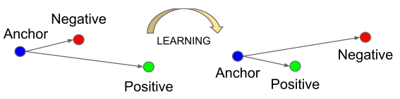

# 1. 损失函数

当我们构建了一个神经网络后，其最初的权重$$w_k$$和偏移量$$b_l$$都是随机的。这种神经网络并不能正确执行任务。我们还需要对其进行训练，使其在给定输入数据$$x$$时的输出$$o$$与$$x$$的标注值$$L(x)$$尽量相近，这种用于训练神经网络的数据集称为训练数据集。例如，我们输入数据$$x$$为一张猫的图片,则$$L(x)=cat$$，我们期望输出$$o=cat$$而不是$$o=dog$$。由于神经网络的输出值是向量，因此我们希望$$L(x)和o$$这两个向量之差的几何距离$$\parallel L(x)-o\parallel$$越短越好，几何距离越短神经网络的实际输出和我们期望的输出越相近。而且我们希望神经网络在训练数据集的所有训练数据上都实现短的几何距离，即要求$$\sum_{i=1}^n \parallel L(x)-o\parallel$$尽量小。我们可以将权重和偏移量当做自变量构建一个函数，来用前面介绍的梯度下降法来获得最小值，这个函数称为损失函数(cost function)：
$$
C(w,b)=\frac{1}{2n}\sum_{i=1}^n\parallel L(x)-o \parallel ^2 \tag{2-1}
$$
其中，$$w$$代表网络中权重的集合，$$b$$偏移量的集合，$$n$$是训练数据集的个数，$$o$$是输出向量，$$L(x)$$是标注值向量。这种形式的损失函数称为二次损失函数，其值肯定非负，当所有训练数据的输出值与标注值相等时，该损失函数值为0。

# 2.训练神经网络

训练神经网络本质上就是找到一组合适的权重和偏移量使得损失函数的值最小。可以利用前面讲过的梯度下降法来求其最小值。求解过程如下：

1. 首先我们有梯度向量$$\nabla C=(\frac{\partial f}{\partial w_k},\frac{\partial f}{\partial b_l})$$

2. 根据梯度向量更新$$w_k$$和$$b_l$$，直到取得损失函数$$C$$的最小值。

$$
w_k'=w_k-\eta \frac{\partial C}{\partial w_k}\tag{2-2}
$$

$$
b_l'=b_l-\eta \frac{\partial C}{\partial b_l}\tag{2-3}
$$

需要注意的是，式（2-1）损失函数包含求和操作，因此计算梯度向量时需要对所有训练数据进行偏微分操作再求和。当训练数据集的数量很大时计算量会非常大，导致训练速度缓慢。一个简单的解决办法是不对所有训练数据求和，而是随机的挑选小批量的训练数据进行计算，这种方法称为<b>随机梯度下降法</b>。

令$$C_x=\frac{\parallel L(x)-o \parallel}{2}^2$$，则$$C=\frac{1}{n}\sum_x C_x$$。梯度向量为：$$\nabla C=\frac{1}{n}\sum_x \nabla C_x$$

从训练数据集中随机选取m（m<n）条数据，使得：
$$
\frac{\sum_1^m\nabla C_x}{m}\approx\frac{\sum_1^n\nabla C_x}{n}=\nabla C \tag{2-4}
$$
因此，将上式带入（2-2）和（2-3）有：
$$
w_k'=w_k-\frac{\eta}{m}\sum_1^m\frac{\partial C_x}{\partial w_k}\tag{2-5}
$$

$$
b_l'=b_l-\frac{\eta}{m}\sum_1^m\frac{\partial C_x}{\partial b_l}\tag{2-6}
$$

需要注意的是，每一次用式（2-5）和（2-6）更新权重和偏移量时都需要随机的选出m个训练数据，而不能每次更新都使用相同的一套m个数据进行计算。随着迭代更新的次数增多，我们随机选取过的数据已经覆盖了整个训练数据集，这时我们称训练完成了一个<b>epoch</b>。epoch大概是时期，时代的意思，在编写人工智能网络的程序时这是一个很常见的训练参数，此外还有batch size也就是m的大小和$$\eta$$的大小需要设置。与权重和偏移量不同，这些参数称为超参数。超参数的值对神经网络的训练效果起着重要作用，但目前为止还没有统一的有效的方法来告诉我们如何找到最佳的超参数。只能根据具体情况进行试错式的调试和实验，但这也正是人工神经网络的迷人之处。

# 3.损失函数的形式

式（2-1）定义的二次损失函数只是损失函数的一种形式，对于一般的模型都可以用这种形式的损失函数。然而有些任务比较特殊，比如训练数据是实时产生的，这样使得训练数据的数量不确定导致n的值是变化的。这种情况下就可以将式中的n去掉，即简单求和不做平均。再比如google的人脸识别人工智能网络FaceNet，使用了一种三态损失函数(Triplet Loss Function)来训练人脸识别模型。每组训练数据为三张人脸照片，一张锚点（Anchor）照片，一张阳性照片（Positive），一张阴性（Negtive）照片。其中锚点和阳性为同一人的两张不同的脸部照片，阴性为另外一个人的照片。通过神经网络（一个多层的卷积神经网络）将照片映射成为一个n维向量，并且限制这个n维向量的长度为特定值。训练的过程就是要让锚点向量和阳性向量差的几何距离尽量小，而锚点向量和阴性向量差的几何距离尽量大，如图2-1所示。

*
图2-1 三态损失函数训练模型1
*

数学表达为1：

$$\parallel f(x_i^a)-f(x_i^p) \parallel _2^2 +\alpha  < \parallel f(x_i^a)-f(x_i^n) \parallel _2^2\tag{2-7}$$

其中$$f(x_i^a)$$为锚点向量，$$f(x_i^p)$$为阳性向量，$$f(x_i^n)$$为阴性向量，$$\alpha$$为阴性和阳性向量之间的必须保持的最小距离。式中下模量符号下角标的2表示将向量长度限制在1以内。

因此，需要被最小化的损失函数为1：
$$
L=\sum_i^N[\parallel f(x_i^a)-f(x_i^p) \parallel_2^2 - \parallel f(x_i^a)-f(x_i^n) \parallel_2^2+\alpha]_+\tag{2-8}
$$

这样训练好的模型可以很好的解决一次学的问题，即只需要提供一张锚点照片，就可以进行身份判断。比如你入职时只需要提供一张照片，就可以每天进行脸部识别打卡，而不是需要你提供脸部各个角度的10几张照片才行。当然这种三态损失函数训练数据的选择也有一些技巧，可以详细阅读参考文献了解更多细节。

Reference

1. Schroff, F., Kalenichenko, D., & Philbin, J. (2015). FaceNet: A unified embedding for face recognition and clustering. *Proceedings of the IEEE Computer Society Conference on Computer Vision and Pattern Recognition*, *07*–*12*–*June*, 815–823. https://doi.org/10.1109/CVPR.2015.7298682