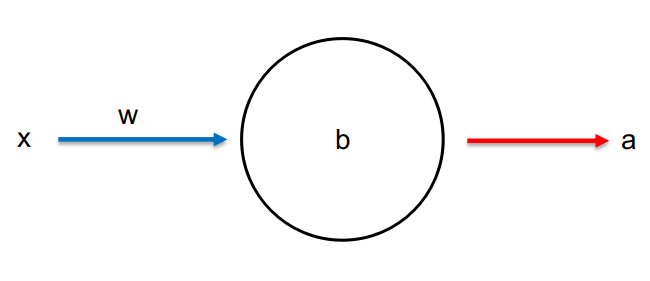
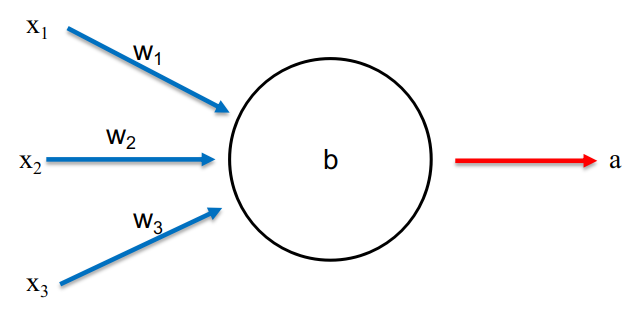
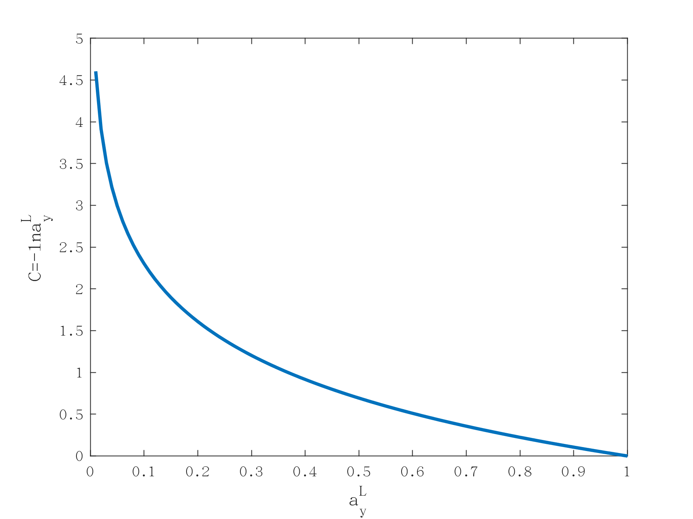

# 1.单个神经元网络

为了简化，我们设计一个最简单的神经网络，单神经元网络。网络中只有一个神经元，如图4-1所示。该神经元的训练目的也非常简单。我们希望当输入数据1给这个神经元时，其输出为0。

*
图4-1 单神经元网络
*

根据[二次损失函数](http://duxinyu.cn//teaching/2018-NN-2)的定义，单神经元网络的损失函数为：
$$
C=\frac{(y-a)^2}{2}\tag{4-1}
$$
式中a为当输入x=1时神经元的输出值，y=0是输入值为1时神经元的期望输出值。这里激活函数我们选用sigmoid函数，因此，a=\sigma (z)，z=wx+b。将其带入式4-1并对损失函数求偏微分可得：
$$
\frac{\partial C}{\partial w}=(a-y)\sigma'(z)x=a\sigma'(z)\tag{4-2}
$$

$$
\frac{\partial C}{\partial b}=(a-y)\sigma'(z)=a\sigma'(z)\tag{4-3}
$$

sigmoid函数如图4-2所示，当其函数值接近1时，曲线非常平坦，因此函数的导数$$\sigma'$$非常小。所以导致式4-2和4-3的值非常小。这是导致学习速度降低的根本原因。

*
图4-2 sigmoid函数
*

# 2.交叉熵损失函数

*
图4-3 三个输入值的单神经元网络
*

为了避免学习速度降低，我们构建了一种新型的损失函数来代替二次损失函数。首先，将我们的单神经元网络稍微扩展一下，将输入量个数增加到三个，如图4-3所示。新的损失函数称为**交叉熵损失函数**的定义如下：
$$
C=-\frac{1}{n}\sum_x[ylna+(1-y)ln(1-a)]\tag{4-4}
$$
观察式4-4可以发现：1.函数值一定大于0。因为a和1-a的值都在[0,1]之间，因此lna和ln(1-a)小于0，所以C大于0。2. 对训练数据集中的所有数据x，其输出值非常接近期望输出值时，该损失函数值接近0。这两个性质和之前介绍的二次损失函数的性质相同，但是交叉熵损失函数具有更为优秀的性质，即学习速度不会变慢。我们通过对交叉熵损失函数求偏导数来证明这点：
$$
\frac{\partial C}{\partial w_j}=-\frac{1}{n}\sum_x(\frac{y}{\sigma(z)}-\frac{(1-y)}{1-\sigma(z)})\frac{\partial \sigma}{\partial w_j}=-\frac{1}{n}\sum_x(\frac{y}{\sigma(z)}-\frac{(1-y)}{1-\sigma(z)})\sigma'(z)x_j\tag{4-5}
$$
上式中$$\sigma'(z)=\sigma(z)(1-\sigma(z))$$，证明如下：

$$
\sigma(z)=\frac{1}{1-e^{-z}}\\ \sigma'(z)=\frac{\partial \sigma}{\partial z}=\frac{\partial \sigma}{\partial (1-e^{-z})}\frac{\partial (1-e^{-z})\sigma}{\partial e^{-z}}\frac{\partial e^{-z}}{\partial z}\\ =-\frac{1}{(1-e^{-z})^2}(-1)(-e^{-z})\\ =\frac{1}{1-e^{-z}}\frac{-e^{-z}}{1-e^{-z}}\\ =\sigma(z)(1-\sigma(z))
$$

 将证明结果带入式4-5可得：
$$
\frac{\partial C}{\partial w_j}=\frac{1}{n}\sum_x x_j(\sigma(z)-y)\tag{4-6}
$$
用相同方法可得损失函数对偏移量的偏导数：
$$
\frac{\partial C}{\partial b}=\frac{1}{n}\sum_x(\sigma(z)-y)\tag{4-7}
$$
与式4-2和4-3相比发现改用交叉熵损失函数后导致学习速度变慢的$$\sigma'(z)$$项消失了。并且惊喜的是不但学习速率不会变慢，而且输出和期望输出值差距$$(\sigma(z)-y)$$，越大学习速率越快，即错的越多，学得越快。以上讨论都是基于单个神经元神经网络模型的，这些结论很容易扩展到多神经元组成的神经网络。一般情况下具有多个神经元的神经网络**交叉熵损失函数**定义如下：
$$
C=-\frac{1}{n}\sum_x\sum_j[y_jlna_j^L+(1-y_j)ln(1-a_j^L)]\tag{4-8}
$$
上式的结构与式4-4相同，只不过多了一个对j的求和，代表着将输出层的所有神经元进行交叉熵运算然后就和。同样的，在多层网络情况下，交叉熵损失函数对权重和偏移量的偏导数为：
$$
\frac{\partial C}{\partial w_{jk}^L}=\frac {1}{n}\sum_xa_k^{L-1}(a_j^L-y_j)\tag{4-9}
$$

$$
\frac{\partial C}{\partial b_j^L}=\frac {1}{n}\sum_x(a_j^L-y_j)\tag{4-10}
$$

式4-9和4-10中仍然保留了之前简化模型所获得的优良性质，即学习速度不减慢，错的越多，学得越快。因此，交叉熵损失函数被广泛的应用于神经网络之中，二次损失函数在函数形式上非常好理解，用来学习神经网络工作原理非常合适。但是在实际应用中，由于其学习速率变慢的问题几乎被抛弃了，大多数情况都用交叉熵损失函数。 

# 3.Softmax激活函数和对数似然损失函数

我们在[神经元即神经网络的结构要素](http://duxinyu.cn//teaching/2018-NN-1)中曾经介绍过softmax激活函数，并且证明了使用softmax激活函数的输出层，所有神经元输出之和为1。softmax神经元输出为：
$$
a_j^L=\frac{e^{z_j^L}}{\sum_k e^{z_j^L}}\tag{4-11}
$$
softmax输出可以看成是概率分布，即输出层中各个神经元输出的是其概率。这种输出非常适合用作分类任务，比如手写识别数字任务。输出层10个神经元分别对应0~9，每个神经元的输出就是手写数字为对应数字的概率。比如第三个神经元输出为0.9，代表着手写输入为2的概率是90%。为了考察softmax激活函数是否会导致学习速率变慢的问题。我们定义**对数似然损失函数**：
$$
C=-lna_y^L\tag{4-12}
$$
式中$$a_y^L$$为输出层中，代表着正确分类的神经元的概率。假如输入一个手写数字2，则期待的输出为2，那么代表着正确分类为2的神经元的概率为$$a_2^L$$，此概率越接近于1，损失函数越小。可以参看图4-4，对数似然损失函数的图形进行理解。横坐标越趋近于1，函数值越接近0。

**
图4-4 对数似然损失函数
**

对数似然损失函数对权重和偏移量的偏导数为：
$$
\frac{\partial C}{\partial w_{jk}^L}=a_k^{L-1}(a_j^L-y_j)\tag{4-13}
$$

$$
\frac{\partial C}{\partial b_j^L}=a_j^L-y_j\tag{4-14}
$$

可以看出，这和sigmoid函数和交叉熵损失函数得到的结果类似。因此，我们可以认为从学习效率的角度上看，softmax和对数似然损失函数配合使用的效果和sigmoid函数和交叉熵损失函数配合使用的效果是一样的。如果任何项目，我们想得到的输出是概率值的话就可以使用softmax函数和对数似然损失函数的组合。需要注意的是，使用softmax和对数似然损失函数时，之前我们导出的[反向传播算法](http://duxinyu.cn//teaching/2018-NN-3)中的I式将变为：
$$
\delta_j^L=a_j^L-y_j\tag{4-15}
$$
其他三个公式不变，因为除了输出层是softmax函数外，其他层还是用的sigmod函数。因此，对于softmax和对数似然损失函数的组合，反向传播算法为：

$$
\delta^L=a^L-y \tag{4-I}
$$

$$
\delta^l=((w^{l+1})^T\delta^{l+1})\odot\sigma'(z^l)\tag{4-II}
$$

$$
\frac{\partial C}{\partial b_j^l}=\delta_j^l\tag{4-III}
$$

$$
\frac{\partial C}{\partial w_{jk}^l}=\delta_j^la_k^{l-1}\tag{4-IV}
$$
