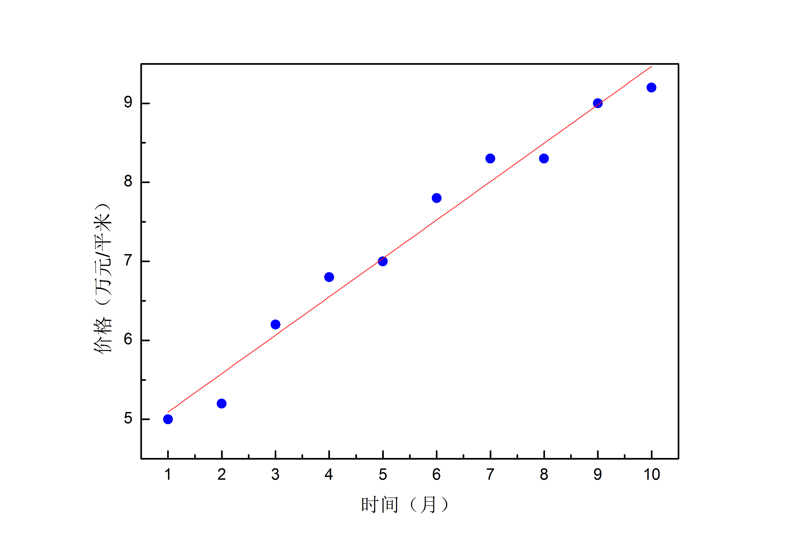

# 1.过拟合

在训练数据相对有限的情况下，训练好的神经网络可能会出现过拟合的问题。可以将其理解为由于训练数据有限，网络不能从中提炼出知识和规律，只是将训练数据死记硬背了下来。所以当对训练数据之外的数据进行运算时，其结果与实际情况会出现较大的偏差。就好比一个小朋友学习算数，我们只教给他1+1=2,1+2=3，这时他还没有真正明白加法的意义和规则。那么这时让他去算1+3=？的时候，结果往往是不正确的。

