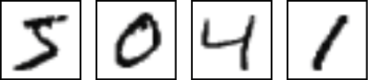
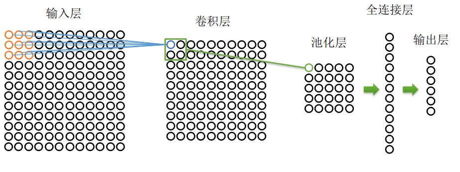

# 1.卷及神经网络CNN

在图像识别分类等应用场景中，输入数据是图形，并且图像信息是与空间位置相关的。如下图所示，深色像素所在位置不同，代表这不同的数字。

*
图6-1 MNIST手写数字训练集
*

因此，Yann LeCun在1998年提出了**卷积神经网络的（convolutional neural network）**。与之前介绍的神经网络不同，CNN网络每层并不是由一列神经元组成，而是由一个二维面组成。典型的CNN由输入层，卷基层，池化层，全连接层和输出层组成，如下图所示。

*
图6-2 典型CNN结构
*

输入层是由若干神经元组成二维平面，每个元素内容为图片相应位置的像素值（RGB或者灰度值）。卷基层神经元的值由感知野大小（图6-2感知野为橘红色方框，尺寸是3x3），步距（橘红方框从左到右，从上到下依次挪动的间隔），权重，和偏移量决定。因此，卷基层蓝色神经元的值为：
$$
a_{11}^2=\sigma(z)\\
z=a_{11}^1*w_{11}^2+a_{12}^1*w_{12}^2+...+a_{33}^1*w_{33}^2+b_{11}^2 \tag{6-1}
$$
在卷基层中，每个神经元对应着3x3个权重和1个偏移量，在感知野移动过程中，这些权重和偏移量保持不变。这套不变的权重和偏移量称为卷积核或者滤波器。不同的卷积核对应不同的卷基层。因此，一个输入层可以导出n个卷基层，n为卷积核的数量，如图6-3所示。图6-2中池化层神经元由池化操作获得，其值为卷基层中绿色方框中四个神经元的最大值，称为最大池化（max-pooling）。除了最大池化外还有L2池化，平均池化等。由图6-2可以看到，池化尺寸为2x2，步距为2，因此池化层的尺寸为5x5个神经元。

*
图6-3 多卷积核生成的多个卷基层
*

