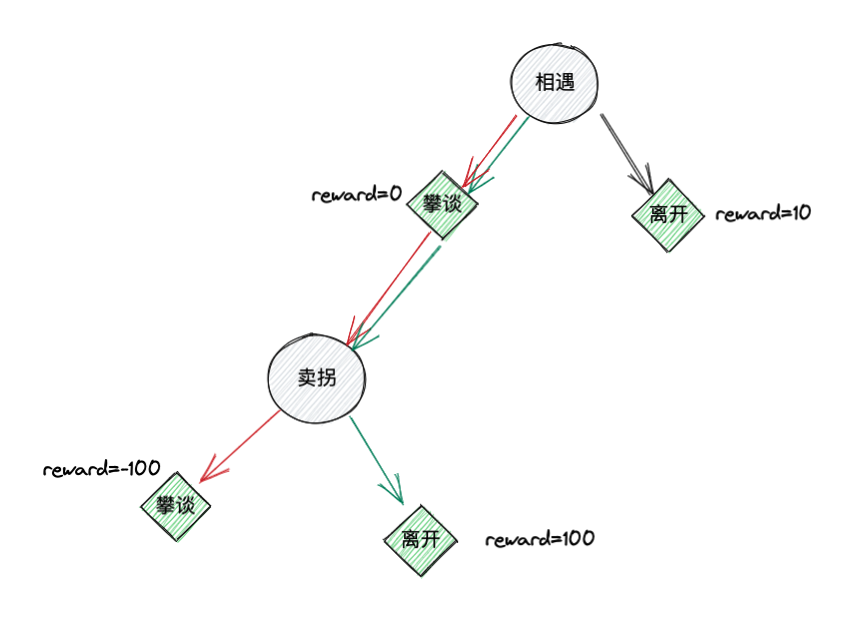

## 1.卖拐ENV

首先，我们根据小品卖拐的故事，构建一个超级简单的环境（ENV），该ENV可以根据action产生state和reward。这个ENV只有两个状态和两个动作，之所以称之为超级简单就是因为其动作空间和状态空间都很小。两个状态分别为：$$S_1$$相遇，$$S_2$$卖拐。两个动作分别为：$$A_1$$攀谈，$$$A_2$$离开。上述ENV中，范伟就是agent。他可以根据不同的state，采取不同的action。在**相遇**这个状态时，范伟有两个选择，离开或者攀谈。如果选择***攀谈***这个动作，不会产生任何后果，ENV会给出reward=0，如果选择***离开***这个动作，大忽悠会说你看他腿有病，给范伟造成心灵造成小伤害但是没有被骗，ENV会给出reward=10。在**卖拐**这个状态时，范伟也有两个选择，***攀谈***和***离开***。如果继续***攀谈***就会被忽悠住，因此ENV给出reward=-100。如果***离开***，则没被忽悠住，ENV给出reward=100。

|                                                              | $$A_1$$=攀谈 | $$A_2$$=离开 |
| ------------------------------------------------------------ | ------------------------------------------------------------ | ------------------------------------------------------------ |
|  $$S_1$$=相遇 | $$Q(S_1,A_1)$$                                               | $$Q(S_1,A_2)$$                                               |
| $$S_2$$=卖拐 | $$Q(S_2,A_1)$$                                               | $$Q(S_2,A_2)$$                                               |

## 2.基本概念

$$
\begin{array}{l}
Reward \quad R_t, \quad agent给出动作A_{t-1}后，ENV返回给agent的奖励或收益。\\如上ENV中，在相遇这个状态(S_1)范伟给出动作离开(A_2)获得的奖励为R_2=-10.
\end{array}
$$

$$
\begin{array}{l}
Return \quad G_t=\sum_{k=0}^\infty\gamma^kR_{t+k+1}, \quad 从t时刻到结束状态累加的奖励。\\\gamma\in(0,1)为累加因子，离当前时间越远的奖励，占比越小。\\比如在状态相遇时范伟采取攀谈这个动作，在状态卖拐时，范伟采取离开这个动作，\\那么G_1=\gamma*R_2+\gamma^2*R_3=\gamma*0+\gamma^2*100=100\gamma^2
\end{array}
$$

$$
\begin{array}{l}
State\quad Value \quad V(S_t)=\mathbb{E}[G_t|S_t=s]=\mathbb{E}[\sum_{k=0}^\infty\gamma^kR_{t+k+1}|S_t=s],\\状态s的价值函数，用累加收益的期望来刻画。\\如上所示，在状态S_t的累加收益G_t存在多种取值，比如在状态相遇时范伟采取攀谈\\这个动作，但在状态卖拐时，范伟不采取离开这个动作而是继续攀谈。\\那么G_1=\gamma*0+\gamma^2*(-100)=-100\gamma^2\\因此，需要用累加收益的期望值来刻画状态价值V(s)
\end{array}
$$

$$
\begin{array}{l}
State-Action\quad Value\quad Q(S_t,A_t)=\mathbb{E}[\sum_{k=0}^\infty\gamma^kR_{t+k+1}|S_t=s,A_t=a]\\和状态价值函数类似，状态-动作价值函数也可以用累加收益的期望来刻画。\\只不过这个收益是在状态s采取具体动作a时产生的。
\end{array}
$$

## 3.算法

上图中每个灰色圆形代表一个状态，每个绿色菱形代表一个动作，动作边上标注了该动作获得的reward。该图是对ENV的一个可视化描述。从图中可以看出，按照绿色箭头的方向和ENV交互可以获得最大的累加收益，按红色箭头的方向获得的累加收益最小（这里假设累加因子$$\gamma=1$$）。从交互开始到交互结束，称为一个episode，可以类比为游戏里面的一局。每采取一个动作后，ENV返回一个新状态并给出reward，称为一个step，可以类比为游戏里面的一个回合。从上图可以看出，黑色箭头所代表的episode只有一个step就结束了，而红色和绿色箭头所表示的episode有两个step。

当范伟遇见大忽悠时，他并不知道ENV根据他的各种action会反馈多少reward，这对他来说是未知的。这就需要他和ENV持续不断的交互，来获得ENV的信息，从而获得上述Q表格中的具体值。这个过程就就是**训练**。

### 3.1时序差分(**TD**, Temporal-Difference Learning) 

$$
\begin{array}{l}
V(S_t)\leftarrow V(S_t)+\alpha[G_t-V(S_t)]
\end{array}
$$
 

上式为TD算法的核心，$$\alpha$$为学习率。其余各项定义在基本概念中已给出。上式的意义为：在agent与ENV交互的过程中，每次agent处于状态$$S_t$$，都需要更新状态价值。更新方法是将累加收益与状态价值的差乘以学习率当做更新值，加到之前的状态价值上。当进行了许多次更新后，状态价值与累加收益的差将变得非常小，状态价值最终收敛到累加收益处。将上式右侧做一下展开推导： 
$$
\begin{array}{l}
\quad V(S_t)+\alpha [G_t-V(S_t)]\\
=V(S_t)+\alpha[\sum_{k=0}^\infty\gamma^kR_{t+k+1}-V(S_t)]\\
=V(S_t)+\alpha[R_{t+1}+\gamma (R_{t+2}+\gamma R_{t+3}+...)-V(S_t)]\\
=V(S_t)+\alpha [R_{t+1}+\gamma G_{t+1}-V(S_t)]\\
\approx V(S_t）+\alpha [R_{t+1}+\gamma V(S_{t+1})-V(S_t)])
\end{array}
$$
 

上述推导最后一步用状态价值替代了累加收益，也是基于随着训练的进行，状态价值将收敛到累加收益。因此，TD算法更新状态价值的公式为： 
$$
V(S_t)\leftarrow V(S_t)+\alpha [R_{t+1}+\gamma V(S_{t+1})-V(S_t)]
$$
 

但是，知道状态价值并不能指导agent做出聪明的行动。比如在**相遇**这个状态，即使范伟知道了这个状态价值的确定值，也不能决定怎么做更好。而能够做出行动指导的是状态-动作价值，也就是Q表格中的值。Q相对于V来说多了一个限制条件-**动作**。例如，处于**相遇**状态时，Q给出采取***攀谈***这个动作的价值为30，采取***离开***这个动作的价值是20。那么范伟就完全可以做出聪明的动作了。Q的定义在基本概念已给出，类比上述推导过程可得更新Q的公式为： 
$$
Q(S_t,A_t)\leftarrow Q(S_t,A_t)+\alpha [R_{t+1}+\gamma Q(S_{t+1},A_{t+1})-Q(S_t,A_t)]
$$
 

观察上式可知，更新一次Q需要$$S_t,A_t,S_{t+1},A_{t+1}$$这个四个量，因此，该算法也称为**Sarsa**（State-Action-Reward-State-Action）。

算法描述如下：

1. 初始化Q表格，表格行数为状态集合中的元素个数，表格列数为动作集合中的元素个数。我们卖拐例子的Q表格是2x2的。Q表格中的值初始化为全0。
2. agent处在任何状态$$S_t$$下，采取的动作$$A_t$$通过查Q表确定。采取的动作为该行Q值最大对应的动作。
3. agent采取动作后ENV给出reward $$R_{t+1}$$和下一个状态$$S_{t+1}$$。
4. 根据Q表格选择状态$$S_{t+1}$$下的最佳动作$$A_{t+1}$$。
5. 更新Q： 
   如果$$S_{t+1}=terminal$$，即episode结束，更新Q： 
   	$$Q(S_t,A_t)\leftarrow Q(S_t,A_t)+\alpha [R_{t+1}-Q(S_t,A_t)]$$  
   否则，更新Q: 
   	$$Q(S_t,A_t)\leftarrow Q(S_t,A_t)+\alpha [R_{t+1}+\gamma Q(S_{t+1},A_{t+1})-Q(S_t,A_t)]$$ 
   回到第3步。

### 3.2 Q-Learning

Sarsa算法的第2步和第4步选取动作时，使用的Q表格为同一个。因此，该算法属于On-Policy算法。也就是选取$$A_t和A_{t+1}$$时，遵循的是同一个策略及Q表格。我们也可以在一个回合结束后就更新Q表格，然后用更新后的Q表格确定$$A_{t+1}$$。走一步更新一次，这样更符合直觉。要达到这个效果，原理上需要将Sarsa算法中$$A_{t+1}$$这项去掉。 
$$
\begin{array}{l}
\quad A_{t+1}=\arg\max \limits_a Q(S_{t+1},a)\\
将上式带入\\
\quad Q(S_{t+1},A_{t+1})\\
=Q[S_{t+1},\arg\max\limits_a Q(S_{t+1},a)]\\
=\max \limits_{a \in A} Q(S_{t+1},a)
\end{array}
$$
 

上式加了max使得$$A_{t+1}$$消失。将上式带入Sarsa的更新公式得： 
$$
\begin{array}{l}
Q(S_t,A_t)\leftarrow Q(S_t,A_t)+\alpha [R_{t+1}+\gamma \max \limits_{a \in A} Q(S_{t+1},a)-Q(S_t,A_t)]
\end{array}
$$
 

因此算法描述如下：

1. 初始化Q表格，表格行数为状态集合中的元素个数，表格列数为动作集合中的元素个数。我们卖拐例子的Q表格是2x2的。Q表格中的值初始化为全0。
2. agent处在任何状态$$S_t$$下，采取的动作$$A_t$$通过查Q表确定。采取的动作为该行Q值最大对应的动作。
3. agent采取动作后ENV给出reward $$R_{t+1}$$和下一个状态$$S_{t+1}$$。
4. 更新Q： 
   如果$$S_{t+1}=terminal$$，即episode结束，更新Q： 
   	$$Q(S_t,A_t)\leftarrow Q(S_t,A_t)+\alpha [R_{t+1}-Q(S_t,A_t)]$$  
   否则，更新Q: 
   	$$Q(S_t,A_t)\leftarrow Q(S_t,A_t)+\alpha [R_{t+1}+\gamma \max \limits_{a \in A} Q(S_{t+1},a)-Q(S_t,A_t)]$$ 
   回到第2步。

可以看到，Q-learning算法每执行一个回合就更新一次Q表格。只需要从ENV获得下一个状态就可以更新Q表格。

### 3.3 冒险

上述算法不论Sarsa还是Q-learning，都存在一个bug。即由于$$\arg\max\limits_a Q(S_{t+1},a)$$的存在，使得在agent与ENV交互时总是走老路（比如卖拐例子中，总是走图中黑色箭头的路径），尤其当你用0初始化Q表格时。这样无论训练多少个episode，都不可能得到最优解。我们采取的办法是让agent有一定概率$$\epsilon$$不按照$$\arg\max\limits_a Q(S_{t+1},a)$$这种贪婪的策略采取行动，而是随机选一个动作执行。因此，$$1-\epsilon$$概率用贪婪策略选动作执行，$$\epsilon$$概率随机选动作执行。称这种策略为$$\epsilon-greedy$$策略。

将这种冒险策略加到上述的算法中去，就形成了完整的Sarsa和Q-learning算法。
