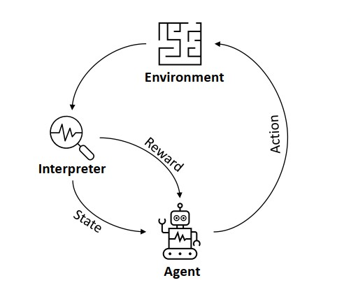

## 1.强化学习问题的框架

​		强化学习问题的常用框架是**智能体-环境(agent-environment)**模型，如下图[1]所示。

其中，**agent**负责学习和做决策，除agent以外的都称为**environment**，上图中的Environment和Interpreter其实都属于**environment**。在某个时刻***t***，agent通过观察环境的状态***statet***，做出决策，采取行动***actiont***，从环境获得收益***rewardt+1***并且通过观察得到一个新的状态***statet+1***。类比下棋可以很好的理解这个过程。

​		agent做决策的过程是典型的Markov decision process (**MDP**)，可以用下述五元组的形式描述：
$$
(\mathcal{S,A,R,P,\gamma})
$$

其中$$\mathcal{S}$$为所有可能状态的集合，$$\mathcal{A}$$为所有可能行动或决策的集合，$$\mathcal{R}$$是收益函数，$$\mathcal{P}$$是状态转移概率，$$\mathcal{\gamma}$$是折扣因子，用来对远期收益进行折扣，即在计算收益时近期的收益占比重较大，越远期比重越小。

​		agent的目标就是学习一个策略$$\pi(a\vert s)$$，使得在状态$$s\in\mathcal{S}$$的情况下采取行动$$a\in\mathcal{A}$$，使得未来的累加收益总和的期望值最大化。

$$
max \mathbb{E}[R(\mathcal{\tau})]\\
其中，\mathcal{R(\tau)}=\sum_{t=0}^\tau\gamma^tr(a_t,s_t)\\
0\le\gamma\le1
$$

​		强化学习的主要目的是学习一个策略$$\pi(a\vert s)$$, 使得累加收益期望最大化，该策略的数学形式为条件概率，即在状态s的情况下，采取动作a的概率。当算法在学习过程中采用相同的策略评价和改进时称为on-policy算法。如果产生数据的策略和被评估和改进的策略不相同，则该算法称为off-policy算法。

## 2.数学基础

2.1 期望值$$\mathbb{E}$$的定义为：

$$
\mathbb{E}[f(x)] = \sum_xP(x)f(x)\\
其中P(x)为变量x的概率函数，f(x)为自变量为x的函数。
$$

假如，x代表某单位员工的身高，f(x)为身高体重函数，P(x)为身高的概率函数，那么f(x)的期望值即为该单位员工的平均体重。

2.2 条件概率：

条件概率是指，在事件B发生的条件下，A事件发生的概率。条件概率表示为：

$$
P(A\vert B)=\frac{P(AB)}{P(B)} \\
P(AB)为事件A和B同时发生的概率\\
P(B)为事件B发生的概率
$$

## 3.常用符号

| 符号                | 含义                                                         |
| ------------------- | ------------------------------------------------------------ |
| $$s\in\mathcal{S}$$ | 状态                                                         |
| $$a\in\mathcal{A}$$ | 动作                                                         |
| $$r\in\mathcal{R}$$ | 收益                                                         |
| $$S_t,A_t,R_t$$     | 在一个迹内，时刻t的状态，动作和收益。有时也用小写字母。      |
| $$\gamma$$          | 折扣系数，用来对未来收益进行折扣计算，该系数值在0到1之间。数学上采用折扣系数的作用是使得累加收益收敛到有限值。 |
| $$G_t$$             | 累加收益；$$G_t=\sum_{k=0}^\infty\gamma^kR_{t+k+1}$$         |
| $$P(s',r\mid s,a)$$ | 状态转移概率，从状态$$s$$采取动作$$a$$，获得收益$$r$$，更新状态到$$s'$$的概率。 |
| $$\pi(a\mid s)$$    | 概率形式得策略函数，在状态$$s$$下，采取动作$$a$$的概率。$$\pi_\theta(\cdot)$$，表示用参数$$\theta$$拟合的策略函数。 |
| $$\mu(s)$$          | 确定性策略函数，有时也用$$\pi(s)$$表示，表示在状态为$$s$$时的动作。 |
| $$V(s)$$            | 状态价值函数，表示状态$$s$$下的期望累加收益。$$V_w(\cdot)$$表示用参数$$w$$拟合的状态价值函数。 |
| $$V^\pi(s)$$        | 采用策略$$\pi$$处于状态$$s$$时，期望的累加收益。$$V^\pi(s)=\mathbb{E}[G_t\mid S_t=s]$$ |
| $$Q(s,a)$$          | 动作价值函数，表示状态$$s$$下采取动作$$a$$的期望累加收益。$$Q_w(\cdot)$$表示用参数$$w$$拟合的动作价值函数。 |
| $$Q^\pi(s,a)$$      | 采用策略$$\pi$$的动作价值函数。$$Q^\pi(s,a)=\mathbb{E}_{a\sim\pi}[G_t\mid S_t=s, A_t=a]$$ |
| $$A(s,a)$$          | 优势函数，$$A(s,a)=Q(s,a)-V(s)$$。可以看做是动作价值函数的升级版，通过减去状态价值降低了动作价值的方差。 |

## 参考文献：

[1] https://arxiv.org/abs/2101.06286